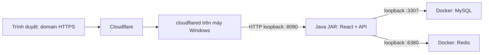

# Chạy KHVT trên Windows và chuẩn bị Cloudflare Tunnel

Kiểm tra cuối trên máy hiện tại ngày 2026-10-10: launcher đã build frontend/backend, start/status/stop và chạy lại bằng `-NoBuild -ExternalDocker` thành công. Lượt HTTP lúc 21:19:50 +07:00 qua kiểm tra giao diện, assets, deep links, API anonymous và CSRF. Chưa kiểm chứng domain/Tunnel hoặc máy Windows khác; xem [bằng chứng và giới hạn](HE_THONG_HIEN_TAI.md).

Hướng dẫn cập nhật ngày **2026-10-10**. Điểm chạy chung là [CHAY_KHVT.cmd](../CHAY_KHVT.cmd) ở thư mục `QuanLyMuaHang`. File này gọi [tools/run-windows.ps1](../tools/run-windows.ps1), build giao diện React, đóng giao diện vào JAR rồi khởi động một tiến trình Java phục vụ cả giao diện và API. Docker Desktop được mở riêng; Compose của dự án chỉ chạy MySQL và Redis.

Launcher đã được chạy trên máy hiện tại lúc **2026-10-10 21:15 +07:00**: cài dependencies/build frontend, đóng gói backend bằng `windows-web`, khởi động Java và health `UP`; giao diện/route trực tiếp cùng JS/CSS trả HTTP 200. Kiểm tra API dùng thông tin tổng hợp: anonymous/sai credentials trả 401, thiếu CSRF trả 403; asset không tồn tại trả 404. Chưa xác nhận login tài khoản thật trong lượt này. Kết quả kiểm tra cụ thể xem [hệ thống hiện tại](HE_THONG_HIEN_TAI.md). Chưa kết nối domain/Tunnel thật, chưa chạy load test và chưa kiểm chứng chuyển sang một máy Windows khác.

## 1. Chuẩn bị máy Windows

Cài trước:

- **JDK 21**, có cả `java.exe` và `javac.exe`; đặt `JAVA_HOME` hoặc thêm thư mục `bin` vào `PATH`.
- **Maven 3.9+** trong `PATH`/`MAVEN_HOME`. Có thể giải nén bản portable vào `tools/apache-maven-<version>`.
- **Node.js 22+** kèm npm trong `PATH`, để build frontend.
- **Docker Desktop**, cấu hình engine Linux để chạy các image MySQL/Redis của dự án.

Launcher không tự cài các công cụ này. Lượt build đầu cần tải dependencies nếu máy chưa có cache. Với `-NoBuild`, không cần Node/Maven để chạy JAR đã đóng gói; vẫn cần JDK 21, cấu hình riêng và MySQL/Redis.

Trong thư mục `QuanLyMuaHang`, tạo cấu hình nếu chưa có:

```powershell
Copy-Item -LiteralPath .\source\.env.example -Destination .\source\.env
```

Không ghi đè `.env` đang dùng. Điền riêng các biến `MYSQL_ROOT_PASSWORD`, `DB_PASSWORD`, `REDIS_PASSWORD`. Nếu khởi tạo quản trị viên đầu tiên, điền `ADMIN_BOOTSTRAP_EMAIL`, `ADMIN_BOOTSTRAP_PASSWORD` và tên hiển thị; mật khẩu tạm ít nhất 12 ký tự. Bootstrap chỉ tạo tài khoản khi cần, không thay mật khẩu tài khoản đã tồn tại.

Giữ `.env` ngoài Git và không gửi nội dung lên chat. Dùng `KEY=value`, một biến mỗi dòng; không đặt lệnh PowerShell/bash trong file. Launcher tự nạp file đúng tại `source/.env`, không phụ thuộc thư mục terminal hiện tại.

`APP_PDF_FONT_PATH` cần trỏ đến font Unicode TTF trên máy. Launcher thử dùng `C:\Windows\Fonts\arial.ttf` khi đường dẫn đang cấu hình không tồn tại. Nếu máy không có font đó, đặt đường dẫn font riêng. `FILE_STORAGE_ROOT` là nơi giữ workbook/PDF và cần sao lưu cùng dữ liệu nghiệp vụ.

## 2. Chạy bằng một file

Mở **Docker Desktop riêng** và đợi engine sẵn sàng. Sau đó bấm đúp `CHAY_KHVT.cmd`, hoặc chạy trong PowerShell tại thư mục `QuanLyMuaHang`:

```powershell
.\CHAY_KHVT.cmd start
```

Khi ứng dụng chưa chạy, launcher thực hiện:

1. Nạp `source/.env`, kiểm tra JDK/cấu hình/cổng.
2. Gọi Compose project `qmh-local` để bật **chỉ `mysql` và `redis`**, rồi đợi hai dịch vụ healthy.
3. Chạy `npm ci` và `npm run build` trong `source/frontend`.
4. Chạy `mvn -Pwindows-web -DskipTests package` trong `source` để đóng `dist` vào static resources của JAR.
5. Chạy Java và kiểm tra `/actuator/health` cùng trang `/login` đã đóng gói.

Giao diện mặc định ở **http://localhost:8080**. Có thể dùng http://127.0.0.1:8080 trên máy đó. Lần này không cần Vite cổng 5173 để phục vụ ứng dụng đã đóng gói. Trong profile `dev`, launcher đặt origin frontend theo cổng ứng dụng và cookie dùng HTTP local.

**Lượt start mặc định bỏ qua bộ test** để phục vụ việc build/chạy. Build thành công và health `UP` chưa phải nghiệm thu nghiệp vụ. Khi kiểm tra thay đổi code, chạy bộ test riêng theo [README backend](../source/README.md) và [README frontend](../source/frontend/README.md).

Nếu launcher đã quản lý một tiến trình healthy, gọi `start` lần nữa sẽ báo ứng dụng đang chạy. Muốn build bản code mới, dừng ứng dụng trước rồi chạy lại.

```powershell
.\CHAY_KHVT.cmd status
.\CHAY_KHVT.cmd stop
.\CHAY_KHVT.cmd start
```

`status` kiểm tra tiến trình do launcher này ghi nhận. `stop` chỉ dừng tiến trình Java được xác minh thuộc JAR của dự án; **MySQL/Redis và Docker Desktop tiếp tục chạy**. Backend chạy trực tiếp bằng VS Code hoặc launcher khác không thuộc quản lý của file này.

## 3. Các lựa chọn khi chạy

| Lựa chọn | Cách dùng và tác dụng |
|---|---|
| `-NoBuild` | Chạy JAR đã có; kiểm tra JAR chứa frontend. Không tự cập nhật code/giao diện. |
| `-ExternalDocker` | Không gọi `compose up`; vẫn kiểm tra Docker engine và hai dịch vụ healthy trong project `qmh-local`. Bạn tự bật các container của dự án trước. |
| `-Profile prod` | Dùng profile HTTPS cho domain public; cần `APP_FRONTEND_URL` là origin HTTPS trong `.env`. |
| `-Port 8081` | Đổi cổng ứng dụng. Không đổi cổng MySQL/Redis; cấu hình Tunnel phải trỏ theo cổng mới. |
| `-HeapMB 512` | Đổi giới hạn Java heap; mặc định 256 MB. Chọn theo RAM và kiểm tra tải thực tế. |
| `-OpenBrowser` | Mở URL ứng dụng sau khi startup kiểm tra thành công. |

Ví dụ chạy lại bản đã build, để Docker do bạn quản lý:

```powershell
.\CHAY_KHVT.cmd start -NoBuild -ExternalDocker -OpenBrowser
```

Nếu muốn tự bật container, mở terminal trong `QuanLyMuaHang/source`:

```powershell
docker compose --project-name qmh-local up -d mysql redis
docker compose --project-name qmh-local ps
```

MySQL dùng `127.0.0.1:3307`, Redis dùng `127.0.0.1:6380`. Không dùng `docker compose down -v` để sửa lỗi startup: lệnh đó xóa volume database. Đổi mật khẩu trong `.env` cũng không tự đổi mật khẩu MySQL đã khởi tạo trong volume; nếu gặp lỗi 1045, đối chiếu cấu hình/tài khoản trước, không xóa dữ liệu để chạy lại.

Nếu cổng ứng dụng bị backend VS Code giữ, dừng đúng phiên debugger hoặc dùng `-Port` khác. Launcher không tự dừng Java của IDE.

Log riêng nằm ở `source/target/runtime/`: `windows-npm-ci.log`, `windows-frontend-build.log`, `windows-backend-build.log`, `windows-app.log` và `windows-app-error.log`. Không gửi nguyên log nếu chứa thông tin nhạy cảm. `windows-app.json` dùng nhận diện tiến trình; không dùng nó để chuyển hoặc sao lưu dữ liệu nghiệp vụ.

## 4. Chạy khi sửa source và kiểm tra thay đổi

Để sửa giao diện với hot reload, dùng `tools/start-local.ps1`. Lần đầu cài dependencies frontend, rồi chạy script từ thư mục gốc `QuanLyMuaHang`:

```powershell
Set-Location .\source\frontend
npm.cmd ci
Set-Location ..\..
powershell.exe -NoProfile -ExecutionPolicy Bypass -File .\tools\start-local.ps1
```

Mở Docker Desktop riêng trước. Script này nạp cấu hình riêng, ép preset `dev`/HTTP local, mặc định heap Java 256 MB, build backend với `-DskipTests` rồi chạy backend và Vite tại **http://localhost:5173**. Sửa React/TypeScript/CSS được Vite cập nhật trong lúc phát triển. Sửa Java/backend cần build và khởi động lại tiến trình Java hoặc phiên debugger VS Code; đây chưa phải hot reload backend.

Chỉ bỏ bước build backend khi JAR đã có và phù hợp với source cần kiểm tra:

```powershell
powershell.exe -NoProfile -ExecutionPolicy Bypass -File .\tools\start-local.ps1 -SkipBuild
```

Không chạy đồng thời backend của `CHAY_KHVT.cmd`, script dev và VS Code trên cùng cổng. Dừng đúng phiên đang chạy trước khi chuyển cách chạy; `CHAY_KHVT.cmd stop` chỉ quản lý tiến trình do chính launcher đó tạo. Sau khi sửa xong, chạy lại `CHAY_KHVT.cmd start` để build bản frontend/backend đóng gói mới.

Backend: mở terminal trong `source`, bảo đảm `JAVA_HOME`/Maven đang dùng **JDK 21**, rồi chạy:

```powershell
mvn.cmd test
```

Frontend: mở terminal trong `source/frontend`. Các script có thật trong `package.json` là:

```powershell
npm.cmd test
npm.cmd run build
npm.cmd run test:e2e -- --workers=1
```

`test` chạy Vitest; `build` kiểm tra TypeScript và build Vite; `test:e2e` chạy Playwright. Browser tests hiện dùng **API giả lập** để kiểm tra giao diện, trạng thái và thao tác; không chứng minh MySQL/Redis, quyền API thật hoặc nghiệp vụ workbook đã nghiệm thu. Chuẩn bị Chromium/Playwright theo [README frontend](../source/frontend/README.md) nếu máy chưa có browser test.

Trong lượt sửa launcher/proxy ngày 2026-10-10, **20 test backend mục tiêu đã qua**: 11 auth, 3 SPA và 6 proxy production. Phạm vi gồm H2/MockMvc và Tomcat HTTP thật với header proxy tổng hợp; không phải chạy lại toàn bộ suite, không phải Cloudflare Tunnel thật. Lượt `CHAY_KHVT.cmd start` vẫn bỏ qua test lúc đóng gói.

## 5. Chuẩn bị profile HTTPS cho Cloudflare

Trong `source/.env` của máy chạy thật, đặt các biến không nhạy cảm theo domain và nơi lưu dữ liệu của bạn. Đây là ví dụ cấu hình, **domain dưới đây phải được thay bằng domain của bạn**:

```dotenv
SPRING_PROFILES_ACTIVE=prod
SERVER_PORT=8080
APP_FRONTEND_URL=https://mua-hang.example.com
SESSION_COOKIE_SECURE=true
APP_PDF_FONT_PATH=C:/Windows/Fonts/arial.ttf
FILE_STORAGE_ROOT=C:/KHVTData/files
```

`APP_FRONTEND_URL` chỉ gồm scheme và hostname/cổng nếu cần, không có đường dẫn con, query hoặc fragment. Bổ sung credentials riêng vào `.env` trên máy; ví dụ này không chứa mật khẩu.

```powershell
.\CHAY_KHVT.cmd start -Profile prod
```

Trong profile `prod`, launcher bật cookie Secure và ứng dụng bind loopback `127.0.0.1`. Cấu hình Tomcat dùng forwarded headers `native`, chỉ tin proxy loopback, giữ Host gốc và bỏ override host/port từ header. Cơ chế này dựa trên [hướng dẫn proxy của Spring Boot 3.4](https://docs.spring.io/spring-boot/3.4/how-to/webserver.html#howto.webserver.use-behind-a-proxy-server).

Health local `http://127.0.0.1:8080/actuator/health` vẫn dùng để kiểm tra startup. Đăng nhập production cần kiểm tra qua **domain HTTPS**. Frontend/API cùng origin và vẫn giữ CSRF, session HttpOnly, permission backend. Không mở CORS `*` hoặc tắt CSRF để giải quyết lỗi đăng nhập.

## 6. Cấu hình Cloudflare Tunnel sau này

Luồng dự kiến khi domain/Tunnel đã cấu hình:



Thực hiện riêng trên máy Windows chạy ứng dụng:

1. Chuẩn bị tài khoản Cloudflare, domain trên Cloudflare và máy có kết nối Internet.
2. Trong dashboard, vào **Networking → Tunnels**, tạo tunnel và chọn môi trường Windows phù hợp.
3. Cài `cloudflared` theo lệnh dashboard. Với remotely managed tunnel, mở CMD Administrator rồi cài connector bằng `cloudflared.exe service install <TUNNEL_TOKEN>`; thay placeholder bằng token riêng tại máy, không đưa token lên chat/repository.
4. Thêm **Published application** route: hostname là domain ứng dụng, Service URL là **`http://127.0.0.1:8080`**. Nếu dùng `-Port` khác, đổi URL này theo cổng đó.
5. Kiểm tra trạng thái Tunnel, mở domain HTTPS và thử login/CSRF, đổi mật khẩu tạm, quyền theo module, tải PDF/XLSX.

Đây là quy trình từ [hướng dẫn Cloudflare Tunnel chính thức](https://developers.cloudflare.com/tunnel/get-started/). Nếu firewall hạn chế, kiểm tra kết nối đi ra Cloudflare theo yêu cầu của hướng dẫn, trong đó có cổng 7844. Không tạo route public cho MySQL hoặc Redis.

Cloudflare thêm `X-Forwarded-Proto` theo giao thức của trình duyệt và ghi đè giá trị do client gửi; xem [HTTP headers của Cloudflare](https://developers.cloudflare.com/fundamentals/reference/http-headers/#x-forwarded-proto). Tuy vậy, hành vi thực tế qua domain/Tunnel của dự án còn phải kiểm tra; test proxy cục bộ không thay thế bước kiểm tra HTTPS thật.

Người giữ tunnel token có thể chạy connector, nên bảo vệ token theo [tài liệu Tunnel tokens](https://developers.cloudflare.com/tunnel/reference/tunnel-tokens/). `cloudflared` trên Windows không tự cập nhật; cần cập nhật theo [hướng dẫn downloads chính thức](https://developers.cloudflare.com/tunnel/downloads/).

Launcher **không tạo Tunnel, DNS, tài khoản Cloudflare hoặc Windows Service**. Cloudflared service quản lý connector riêng; nó không tự chạy ứng dụng Java hay Docker Desktop.

## 7. Chuyển sang máy Windows khác

Máy mới cần các công cụ ở bước 1 và một thư mục ứng dụng đầy đủ. Tạo `.env` riêng cho máy đó, kiểm tra đường dẫn font/file storage và cấu hình origin. Build lại bằng `CHAY_KHVT.cmd start`, hoặc chuyển JAR đã chứa frontend rồi chạy `-NoBuild` trong cấu trúc thư mục ứng dụng tương ứng.

**Copy source/JAR không mang theo database.** Dữ liệu MySQL đang nằm trong volume Docker trên máy cũ; không chép trực tiếp volume đang chạy hoặc coi việc copy thư mục dự án là migration dữ liệu. Với dữ liệu cần giữ:

1. Sao lưu MySQL bằng công cụ backup phù hợp và sao lưu toàn bộ `FILE_STORAGE_ROOT` cùng thời điểm; giữ bản gốc trước khi chuyển.
2. Khôi phục vào MySQL trên máy mới theo quy trình có kiểm soát; đối chiếu schema, số liệu, tài khoản và file artifacts.
3. Kiểm tra credentials `.env` với tài khoản database đã khôi phục. Flyway kiểm tra/cập nhật schema khi ứng dụng khởi động.
4. Kiểm thử nghiệp vụ và download chứng từ trên máy mới trước khi chuyển hostname/Tunnel tới đó.

Redis chứa session; chuyển sang Redis mới có thể yêu cầu người dùng đăng nhập lại. Nó không thay thế backup MySQL hoặc thư mục chứng từ. Tunnel/hostname cần cấu hình connector cho máy mới; không suy ra nó đã được chuyển chỉ vì JAR chạy được.

## 8. Chạy lâu dài sau reboot/logoff

Launcher phục vụ thao tác build và start/stop/status thủ công. Tiến trình Java chạy nền theo lần gọi script, **chưa được đăng ký Windows Service, chưa có tự chạy sau reboot hoặc recovery tự động**. Không coi việc đóng cửa sổ launcher là bằng chứng ứng dụng sẽ chạy liên tục qua logoff/reboot.

Cloudflare khuyến nghị [chạy cloudflared dưới dạng service](https://developers.cloudflare.com/tunnel/features/locally-managed-tunnels/as-a-service/) để connector khởi động theo máy. Muốn phục vụ lâu dài, cần thêm cơ chế service/Task Scheduler phù hợp cho ứng dụng, kiểm tra Docker startup, tài khoản chạy, quyền đọc `.env`/ghi file, khôi phục khi tiến trình lỗi và backup định kỳ. [Microsoft mô tả Windows Service cho daemon cần duy trì hoạt động](https://learn.microsoft.com/en-us/windows/win32/services/about-services).

Các cấu hình tự khởi động đó chưa được cài bởi `CHAY_KHVT.cmd`. Cloudflare Tunnel cũng không thay thế máy chủ đang bật hoặc backup dữ liệu.

## 9. RAM ứng dụng, container và WSL

Heap Java mặc định **256 MB** là giới hạn heap, không phải giới hạn toàn bộ RAM của tiến trình. Java còn dùng bộ nhớ cho metaspace, code cache, thread và phần native. Hai launcher giới hạn Hikari tối đa **5 kết nối**, tối thiểu **1 kết nối idle**; đây là preset vận hành ban đầu, chưa phải kết quả load test. Java language server/debugger của VS Code là tiến trình riêng và không nằm trong giới hạn heap của ứng dụng.

Compose hiện đặt giới hạn MySQL **1536 MiB**, Redis **256 MiB**; MySQL buffer pool 512 MiB và Redis `maxmemory` 128 MiB là các giới hạn riêng bên trong container. Kiểm tra lúc **2026-10-10 21:17 +07:00**: `docker stats --no-stream` báo MemUsage khoảng **375,9 MiB / 1,5 GiB** cho MySQL và **5,02 MiB / 256 MiB** cho Redis. Đây là số Docker báo tại thời điểm đó, không phải RSS thuần hay mức dùng cao nhất. Volume/schema và số tài khoản được đối chiếu giữ nguyên; không reset database/volume để áp dụng. Redis có 15 key sau các request CSRF tổng hợp, nên không coi số key là bất biến khi kiểm tra giao diện. Đối chiếu `mem_limit` trong `source/docker-compose.yml` và container đang chạy khi kiểm tra cấu hình sau này; không suy ra giới hạn hiện tại chỉ từ log cũ.

Windows có thể hiển thị `VmmemWSL` lớn hơn tổng RAM hai container: WSL dùng VM/kernel chung, có page cache và có thể chứa các distro/dịch vụ khác. Không cộng heap Java với giới hạn container rồi coi đó là tổng RAM toàn máy. Theo [Docker Desktop settings](https://docs.docker.com/desktop/settings-and-maintenance/settings/#advanced), khi dùng backend WSL 2, giới hạn memory/CPU/swap của VM nằm ở cấu hình WSL; các thanh giới hạn VM trong Docker Desktop có phạm vi nền tảng khác.

Nếu cần điều chỉnh RAM WSL, đây là các **lựa chọn thủ công**, không được launcher tự áp dụng:

- Mở **WSL Settings** từ Start menu để xem memory limit đang dùng. Microsoft khuyến nghị chỉnh bằng Settings thay vì ghi đè `.wslconfig`; cấu hình này ảnh hưởng tất cả distro WSL 2 của người dùng, không chỉ KHVT. Xem [WSL advanced settings](https://learn.microsoft.com/en-us/windows/wsl/wsl-config#main-wsl-settings).
- Kiểm tra **`autoMemoryReclaim`**. Theo tài liệu Microsoft hiện tại, có `gradual` để thu hồi cache từ từ, `dropCache` để thu hồi nhanh và `disabled` để tắt; mặc định được tài liệu ghi là `dropCache`. Đừng suy ra máy đang dùng mặc định nếu đã có cấu hình riêng. [Docker khuyến nghị tính năng này](https://docs.docker.com/desktop/features/wsl/#prerequisites) để trả lại cache không dùng sau build; [Microsoft mô tả tùy chọn](https://learn.microsoft.com/en-us/windows/wsl/wsl-config#experimental-settings).
- **Resource Saver** của Docker Desktop với WSL 2 giúp giảm CPU lúc idle, nhưng không tự giảm RAM của VM WSL dùng chung. Không dùng nó làm cam kết rằng `VmmemWSL` sẽ xuống ngay; xem [Resource Saver trên Windows](https://docs.docker.com/desktop/use-desktop/resource-saver/#resource-saver-mode-on-windows).

Áp dụng cấu hình WSL có thể cần khởi động lại WSL vào thời điểm phù hợp cho các dịch vụ đang chạy. Lượt triển khai này không sửa `.wslconfig` hoặc tắt/khởi động lại WSL toàn máy. Giới hạn RAM cần được đánh giá lại theo dữ liệu, số người dùng và tải thực tế trước khi vận hành lâu dài.
