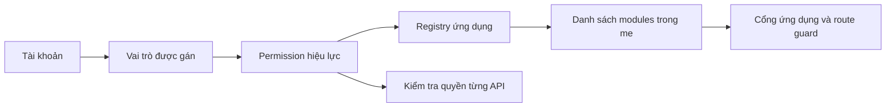

# Cổng ứng dụng và phân quyền KHVT

Ngày cập nhật: 2026-10-10. Tài liệu phân biệt phần đã có trong code với hướng mở rộng; kết quả kiểm thử được ghi riêng tại [hệ thống hiện tại](HE_THONG_HIEN_TAI.md).

## Trải nghiệm sau đăng nhập

Sau khi đăng nhập và hoàn tất đổi mật khẩu tạm, người dùng tới `/modules`. Trang này hiển thị các ứng dụng được cấp quyền dưới dạng ô có biểu tượng, tên và mô tả. Chọn một ô để vào khu vực làm việc; nút Cổng ứng dụng cho phép quay lại để đổi ứng dụng. Người không có quyền nào thấy thông báo liên hệ quản trị viên, không thấy ô giả hoặc ứng dụng chưa triển khai.

Ảnh người dùng cung cấp là tham khảo cho cách chọn ứng dụng. Giao diện KHVT dùng tên và biểu tượng của chính dự án, palette xanh rêu/xanh ngọc; không sao chép nhãn sản phẩm trong ảnh.

Footer ở trang đăng nhập, cổng ứng dụng và khu vực làm việc dùng nội dung: **© Bản quyền thuộc về KHVT | Cung cấp bởi [ThuanNgcodelor](https://github.com/ThuanNgcodelor)**.

## Cách cấp quyền đang có

Hệ thống hiện dùng vai trò và permission. Admin gán một hoặc nhiều vai trò khi tạo/sửa tài khoản trong Quản trị → Tài khoản. Backend hợp các permission hiệu lực của người dùng từ vai trò, đối chiếu với `ApplicationModuleCatalog`, rồi trả `permissions` và `modules` trong kết quả login, `me` và đổi mật khẩu. Frontend hiển thị danh sách đó; không tự quyết định quyền ứng dụng từ tên vai trò.

Registry hiện được khai báo trong code backend, chưa phải bảng danh mục cho admin tự thêm ứng dụng:

| Mã ứng dụng | Tên | Điều kiện hiển thị | Trang vào |
|---|---|---|---|
| `PURCHASING` | Mua hàng | Có cả `PO_READ` và `CATALOG_READ` | `/dashboard` |
| `PERSONNEL` | Nhân sự | Có `PERSONNEL_READ` | `/admin/employees` |
| `ADMINISTRATION` | Quản trị | Có `USER_READ` | `/admin/users` |

Permission wildcard `*` được nhận diện ở backend và mở các ứng dụng đã đăng ký. Vai trò mặc định `ADMIN` có permission này; tên vai trò `ADMIN` riêng lẻ không phải điều kiện bypass kiểm tra module hoặc permission frontend. Hiện các vai trò mặc định có kết quả:

| Vai trò | Ứng dụng được hiển thị | Phạm vi |
|---|---|---|
| `ADMIN` | Mua hàng, Nhân sự, Quản trị | Toàn quyền theo wildcard |
| `PLANNER` | Mua hàng | Danh mục, giá, đơn mua và import yêu cầu theo permission hiện có |
| `VIEWER` | Mua hàng | Đọc/tra cứu; không cấp quyền ghi |
| `HR_MANAGER` | Nhân sự | Quản lý hồ sơ và danh mục nhân sự |

Ví dụ, admin gán `PLANNER` cho một tài khoản để cấp Mua hàng; gán thêm `HR_MANAGER` để tài khoản có cả Mua hàng và Nhân sự. Đổi vai trò hiện là thao tác quản trị trực tiếp, không có bước người dùng xin quyền hoặc admin duyệt yêu cầu. Backend thu hồi các phiên hiện có khi cập nhật tài khoản; lần đăng nhập sau tải lại quyền và danh sách ứng dụng.

Thao tác hiện tại: mở Quản trị → Tài khoản → Thêm hoặc Sửa → chọn vai trò → xác nhận tác động phiên → lưu. Tài khoản mới có mật khẩu tạm tối thiểu 12 ký tự và phải đổi mật khẩu khi đăng nhập. Admin không được tự khóa/vô hiệu hóa tài khoản của mình hoặc gỡ/khóa admin hoạt động cuối cùng; các ràng buộc này được backend kiểm tra. Sửa tài khoản của chính mình có thể thu hồi phiên hiện tại.

`GET /api/admin/roles` trả `permissions` và `moduleCodes` cho từng vai trò. `moduleCodes` là kết quả registry tính từ permission của chính vai trò đó, giúp form mô tả ứng dụng đi kèm; nó không phải danh sách grant có thể sửa. Quyền cuối cùng của tài khoản được tính từ hợp permission của tất cả vai trò, rồi registry tính lại danh sách `modules` trong phiên.

Hệ thống chưa có grant module riêng theo từng tài khoản, API tạo/sửa vai trò hoặc ma trận permission. Payload tạo/sửa tài khoản nhận `roleCodes`, không nhận `moduleCodes` hay grant ứng dụng. Frontend dùng danh sách `permissions` hiệu lực trong thông tin phiên để kiểm tra route/thao tác của các màn đã triển khai; tên vai trò được dùng để giải thích quyền được gán.

## Hiển thị ứng dụng và quyền thao tác

Quyền thấy ô Mua hàng không có nghĩa được phép tạo, sửa hoặc hủy PO. Mỗi API vẫn kiểm tra permission tương ứng ở backend. Người dùng gõ URL trực tiếp hoặc tự gửi request không thể lấy quyền bằng cách bỏ qua trang chọn ứng dụng.

Route guard và menu hỗ trợ điều hướng. Spring Security, kiểm tra quyền controller/service và trạng thái tài khoản/nhân viên mới là nơi bảo vệ dữ liệu. Trước khi đổi mật khẩu tạm, người dùng vẫn bị chặn các API nghiệp vụ dù danh sách ứng dụng đã có trong thông tin phiên.

## Khi cần cấp ứng dụng độc lập với vai trò

Phần dưới đây là **thiết kế đề xuất, chưa triển khai**. Chỉ cần mở rộng khi tổ chức muốn tách quyền vào ứng dụng khỏi vai trò hành động, ví dụ cùng vai trò chuyên viên nhưng chỉ một số người được mở Bán hàng.

Khi đó có thể bổ sung:

| Bảng đề xuất | Dữ liệu chính |
|---|---|
| `application_modules` | Mã ổn định, tên, mô tả, trạng thái triển khai/hoạt động; đường dẫn thuộc danh sách route do ứng dụng sở hữu |
| `user_module_grants` | Người dùng, module, trạng thái cấp/thu hồi, người cấp, thời điểm; một grant hiệu lực cho mỗi cặp user/module |
| `module_access_requests` | Chỉ cần nếu có quy trình xin quyền: người yêu cầu, module, lý do, trạng thái, người duyệt và thời điểm |

Quyền truy cập khi ấy cần cả **grant module hiệu lực và permission hành động**. Cấp Mua hàng không tự cấp `PO_CREATE`; thu hồi grant phải chặn toàn bộ nhóm API Mua hàng, không chỉ ẩn ô ở frontend. Backend cần kiểm tra grant trong luồng authorization, audit các thay đổi và thu hồi/làm mới phiên để tránh quyền cũ còn trong session. Quyền wildcard của admin và việc có cần grant riêng cho admin phải được chốt rõ trước khi chuyển mô hình.

Không nên thêm checkbox "đã cấp ứng dụng" chỉ lưu ở frontend: nó không kiểm soát được request API và dễ lệch với quyền trong session. Với nhu cầu hiện tại, tận dụng vai trò đã có giữ được một nguồn quyền; thêm grant độc lập sau khi có yêu cầu nghiệp vụ cụ thể.

## Mở rộng Bán hàng

Bán hàng là một module mới trong cùng ứng dụng Spring Boot trước tiên; không cần tách microservice chỉ để thêm một ô trên cổng ứng dụng.

Trình tự mở rộng:

1. Xác định nghiệp vụ Bán hàng và permission, ví dụ `SALES_READ`, `SALES_MANAGE`; tên này hiện là đề xuất, chưa tồn tại trong hệ thống.
2. Thêm module nghiệp vụ, schema bằng migration mới, API và kiểm tra quyền backend.
3. Thêm pages/hooks/services và route riêng cho Bán hàng.
4. Đăng ký `SALES` trong registry khi đã có màn vào sử dụng được; không mở ô dẫn tới tính năng chưa tồn tại.
5. Gán permission qua vai trò được quản trị, hoặc grant độc lập nếu đã triển khai mô hình ở trên; kiểm tra người không có quyền, URL trực tiếp và thu hồi phiên.

Danh tính, đăng nhập, nhân sự, audit và cổng ứng dụng được dùng chung. Dữ liệu/logic Mua hàng và Bán hàng thuộc module sở hữu; việc chia sẻ vật tư hoặc đối tác cần contract rõ thay vì tham chiếu tùy ý giữa các module.

## Điểm kiểm tra

- ADMIN, PLANNER, VIEWER và HR_MANAGER thấy đúng tập ứng dụng từ backend.
- Login và hoàn tất đổi mật khẩu dẫn về cổng ứng dụng; reload giữ phiên, logout/hết phiên xóa cache riêng tư.
- Người không có quyền không vào được route trực tiếp và API tương ứng vẫn trả 403.
- Thay vai trò/khóa tài khoản/ngừng nhân viên không để phiên cũ tiếp tục dùng quyền đã thu hồi. Test servlet/H2 không xác nhận thu hồi session Redis thật.
- Cổng ứng dụng, bảng và dialog đọc được trên desktop/mobile, dùng được bằng bàn phím.

Các kiểm tra trên là tiêu chí; chỉ đánh dấu đã chạy khi có báo cáo hoặc log tương ứng.
